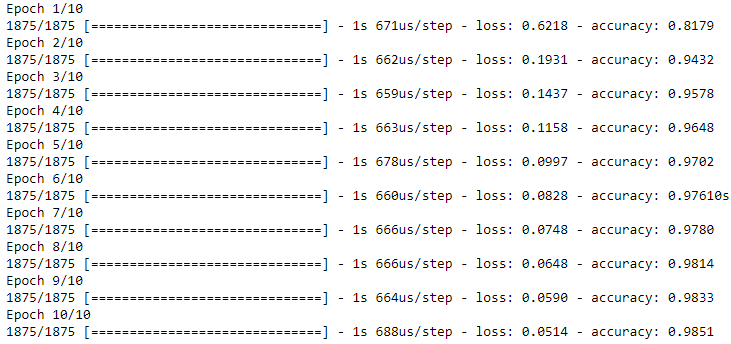
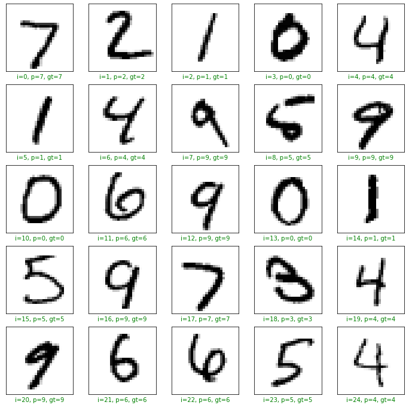

# Image-Classification-with-Tensorflow-Guide

Image classification scratches the surface of machine learning. The notes in this notebook were taken as I was going through the course [Image Classification with Tensorflow](https://www.coursera.org/learn/tensorflow-beginner-basic-image-classification/home/welcome). 

View the Jupyter Notebook [HERE](https://nbviewer.jupyter.org/github/gianmillare/Image-Classification-with-Tensorflow-Guide/blob/main/project_guide.ipynb)!

Alongside showing step by step code to create an image classification model, I also took notes on the algorithms and equations used behind certain neural network creation. Also, notes and tips on evaluation and predictive modeling are shown in the notebook as well to justify the methods used to build the model. At the end of the lesson, the resulting model acheived an accuracy of around 98%, and I used the first 25 images as an example of the models output.

Skills highlighted: Python Programming, Classification modeling, Machine Learning, Algorithms  
Libraries used: Tensorflow, Keras, MNIST, NumPy, Matplotlib

Credit: [Coursera Guided Projects](https://www.coursera.org/search?&tab=guided-projects)

Preview: Metrics Output from 10 Epochs

Preview: Classification Results of images 1-25 (100% for this set)

